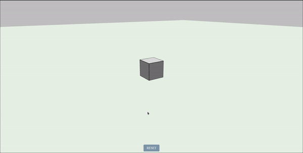

# Babylon Extrude

This is a simple Babylon.js application that allows users to extrude or intrude a cube from its faces to modify its shape

<!-- demo video -->

## Demo
Checkout the demo at [Babylon Extrude](https://babylon-extrude.netlify.app/)

## Getting Started

To get started with this project, follow these steps:

1. Clone the repository to your local machine.
2. Install the dependencies by running `npm install`.
3. Start the development server by running `npm run dev` (more info in [package.json](package.json)).
4. Open your web browser and navigate to the link shown in the terminal.

## Usage
Once you have the project running, you can use the check out the following controls and features:

- Use the mouse to rotate the camera around the scene.
- Use the right mouse button to pan the camera around the scene.
- Use the scroll wheel to zoom in and out.
- Click and drag on the canvas to move the camera around the scene.
- Click on a face of the cube to select it and then drag the mouse to extrude or intrude the face.
- View the extrusion distance in the top center of the screen.
- Press the "Reset" button to reset the cube to its default shape.

## Contributing

If you'd like to contribute to this project, feel free to submit a pull request. Please make sure your code adheres to the existing coding style and passes the existing unit tests.

## License

This project is licensed under the MIT License. See the [LICENSE](LICENSE) file for details.

## Acknowledgments

This project was inspired by the Babylon.js documentation and the many helpful contributors in the Babylon.js community.
